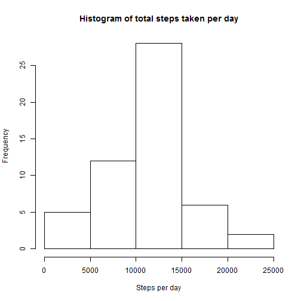
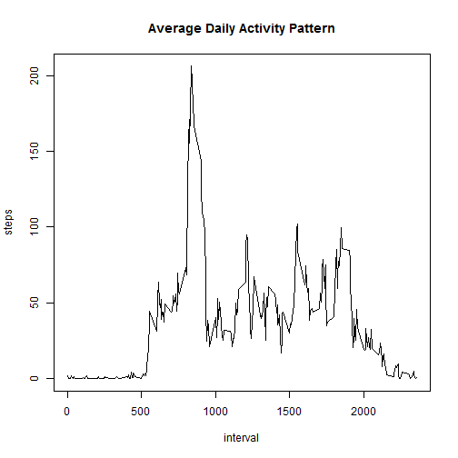
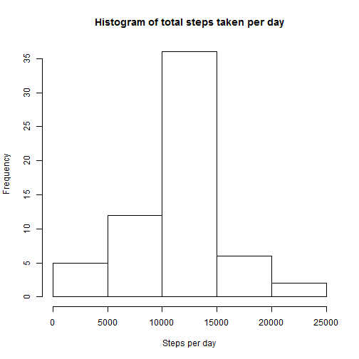

###CALCULATING NUMBER OF STEPS PER DAY

```r
activity<-read.csv("activity.csv")
stepsperday<-aggregate(steps~date,data=activity,FUN = sum)
hist(stepsperday$steps,xlab="Steps per day",main = "Histogram of total steps taken per day")
```

 

```r
meanstepsperday<-mean(stepsperday$steps)
medianstepsperday<-median(stepsperday$steps)
```

The mean of total steps taken per day = 1.0766189 &times; 10<sup>4</sup>

The median of total steps taken per day = 10765

###CALCULATING AVERAGE NUMBER OF STEPS PER INTERVAL

```r
meanstepsperinterval<-aggregate(steps~interval,data=activity,FUN = mean)
plot(meanstepsperinterval,type = "l",main = "Average Daily Activity Pattern")
```

 

```r
intervalmaxsteps<-meanstepsperinterval$interval[which(meanstepsperinterval$steps==max(meanstepsperinterval$steps))]
```

The maximum number of steps is taken in the interval 835

###REPLACING MISSING VALUES AND CREATING NEW ACTIVITY SET

```r
missing<-!complete.cases(activity) #row indexes of missing values
numofna<-sum(missing)              #number of missing values
newactivity<-activity
newactivity$steps[missing]<-meanstepsperinterval$steps[match(activity$interval[missing],meanstepsperinterval$interval)] #replace the missing values by mean for that interval

newstepsperday<-aggregate(steps~date,data=newactivity,FUN = sum)
hist(newstepsperday$steps,xlab="Steps per day",main = "Histogram of total steps taken per day")
```

 

```r
newmeanstepsperday<-mean(newstepsperday$steps)
newmedianstepsperday<-median(newstepsperday$steps)
```

The total number of missing values = 2304

Replacing missing values with **means for the interval**

The mean of total steps taken per day = 1.0766189 &times; 10<sup>4</sup>

The median of total steps taken per day = 1.0766189 &times; 10<sup>4</sup>

On replacing the missing values:

There is no change in the mean.

However the median moves to become equal to the mean.


###STEPS PER INTERVAL CATEGORISED BY WEEKDAY AND WEEKEND

```r
newactivity$Day<-as.factor(weekdays(as.Date(newactivity$date)) %in% c("Saturday","Sunday"))
levels(newactivity$Day)[levels(newactivity$Day)=="FALSE"]<-"Weekday"
levels(newactivity$Day)[levels(newactivity$Day)=="TRUE"]<-"Weekend"
library(ggplot2)
```

```
## Warning: package 'ggplot2' was built under R version 3.1.3
```

```r
newstepsperinterval<-aggregate(steps~Day+interval,data=newactivity,FUN = mean)
g<-ggplot(newstepsperinterval,aes(interval,steps))+geom_line(col="blue")+facet_grid(Day~.)
print(g)
```

 

